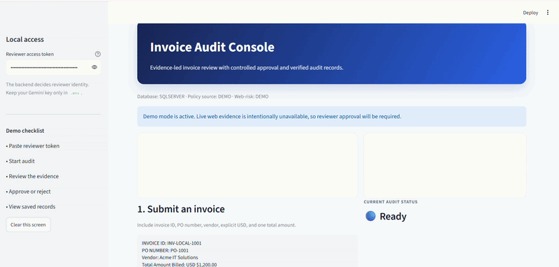
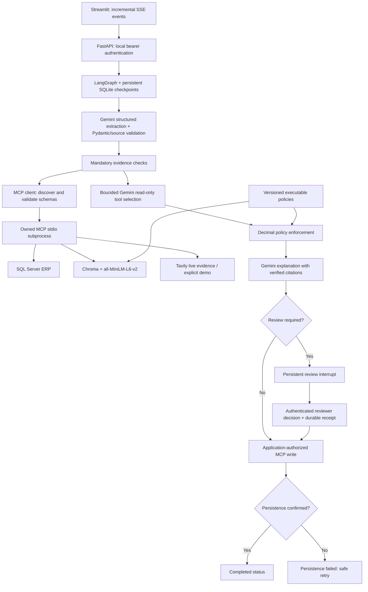

<div align="center">

# Invoice Audit Intelligence

### A Gemini-powered, evidence-led workflow for invoice review and human approval

[](https://www.python.org/)
[](https://fastapi.tiangolo.com/)
[](https://ai.google.dev/)
[](https://modelcontextprotocol.io/)
[](https://www.microsoft.com/sql-server)

**Built by R.D.D.S Rajamuni**

</div>

This application extracts **USD text invoices** using Gemini, retrieves ERP/policy/web evidence through real MCP stdio clients, applies exact Python financial rules, and explains the result using retrieved policy evidence. Eligible cases persist automatically. Review cases pause in SQLite-backed LangGraph state and require a server-authenticated reviewer.

This is a local application with local token authentication, not a production identity or payment system. It does not execute payments. The old regex extraction, direct tool calls and category-derived benchmark decisions have been replaced.





## Local setup (Windows PowerShell)

Run commands from the repository root. Python **3.13** was used for local verification. `requirements.txt` pins the direct dependency set; it is not a complete cross-platform lockfile. No live credentials are bundled.

```powershell
py -3.13 -m venv venv
.\venv\Scripts\Activate.ps1
python -m pip install -r requirements-dev.txt
Copy-Item .env.example .env
python -c "import secrets; print(secrets.token_urlsafe(32))"
```

If `.env` already exists, edit it instead of copying over it. Generate a different random token for each person. Configure `AUDIT_USERS_JSON` with server-owned identities and `reviewer` or `submitter` roles. Placeholder tokens are rejected. Enter a person's token in the Streamlit sidebar; the browser cannot choose their reviewer identity. All authenticated local users can inspect audit records; tenant isolation and enterprise SSO are not implemented.

For the supplied local demonstration, edit `.env` and set `GEMINI_API_KEY` to your Gemini key, `GEMINI_MODEL=gemini-2.5-flash`, `DB_MODE=sqlserver`, your `DB_CONNECTION_STRING`, `POLICY_MODE=demo`, and `WEB_RISK_MODE=demo`. Keep your reviewer token private and enter it only in the Streamlit sidebar. `TAVILY_API_KEY` is needed only when `WEB_RISK_MODE=live`.

Verify Gemini once before opening the UI:

```powershell
python -m backend.app.check_gemini
```

The free Gemini tier has provider request limits. If it returns `429 RESOURCE_EXHAUSTED`, the key is valid but its quota is exhausted; wait for the provider's daily reset or use a billed project. Do not repeatedly run this check because it makes one Gemini request. A missing Gemini key causes an explicit error, never regex fallback. Bare `$` without `USD` or `US$` is considered ambiguous. Missing/zero/negative amounts, unsupported currencies and invalid PO fields cannot be approved. Optional descriptions/dates are interpretation aids, not SOW evidence.

### SQL Server

SQL Server remains the live backend. Install Microsoft's ODBC Driver 18 and use its exact name in `DB_CONNECTION_STRING`. An existing Windows Driver 17 installation can be used by changing the connection string's driver name explicitly. Use an account with SELECT on ERP tables and SELECT/INSERT on `AuditRecords` and `AuditLogs`; do not grant the application permission to modify purchase/vendor evidence.

For the supplied local Windows-authentication SQL Server setup with legacy ODBC Driver 17, use `Encrypt=no` when the instance does not have a trusted TLS certificate. This is a local-development setting; use encryption with a valid certificate in a deployed environment.

For a **new disposable sample database**, review and run:

```powershell
sqlcmd -S localhost -E -i sql/schema.sql
sqlcmd -S localhost -E -d AuditDB -i sql/migrate_v2.sql
```

`schema.sql` creates AuditDB and sample rows; do not run it on an existing database. For an existing database, review and apply only `sql/migrate_v2.sql` using your normal database administration process. It adds evidence columns and a new append-only `AuditRecords` table. Each confirmed final decision is also inserted into the existing `AuditLogs` table so existing SQL Server views and dashboards continue to show it. `sql/configure_local_sample_evidence.sql` explicitly fills the supplied local sample PO fields for demonstrations. A claimed SOW in invoice text never satisfies this check.

```powershell
python -m sql.test_db
```

No SQL migration or production-data evaluation was executed during this implementation.

### Explicit demo database / web mode

For local UI work without SQL Server, initialize a separate SQLite demo database:

```powershell
python -m backend.app.storage --init-demo data/demo.sqlite
```

Set `DB_MODE=demo`, `DEMO_DB_PATH=data/demo.sqlite`, `POLICY_MODE=demo`, and `WEB_RISK_MODE=demo` in `.env`. Gemini is still real and requires a key. Demo policy retrieval returns the canonical rules without embeddings. Demo web checks visibly report **unavailable**, never invented adverse news or a simulated clean result. They require reviewer acceptance. To work entirely without credentials, use the offline tests/evaluator below; they inject controlled responses into the real graph.

### Policy initialization and updates

For real vector retrieval, set `POLICY_MODE=chroma` and run:

```powershell
python -m backend.app.policy_index
```

The first run downloads `sentence-transformers/all-MiniLM-L6-v2` if it is not cached. Chroma ranks the complete four-rule corpus; all four rules are required for an audit, rather than retrieving only two and silently missing mandatory controls. Retrieval is checked against the exact active text, conditions, IDs and versions. Missing or stale indexes require review.

Edit the authoritative conditions in `backend/app/policies.py`, increment `VERSION`, regenerate the index with the command above, and rerun tests. Retrieval documents are generated from those same conditions. New versions use separate collections, so old evidence is not silently rewritten. Restart the backend after policy changes. Existing paused audits retain their original evidence and version; reject/resubmit them if updated policy must apply.

### Backend, MCP and UI startup

Run in two activated terminals:

```powershell
python -m uvicorn backend.app.main:app --host 127.0.0.1 --port 8000 --workers 1
```

```powershell
python -m streamlit run backend/app/app_ui.py
```

The backend automatically starts `python -m mcp_servers.audit_server` as an owned stdio subprocess for each execution/resume. The client initializes MCP, discovers schemas, validates arguments and consumes structured results. It closes the session and subprocess after the operation. Separate manual MCP startup is unnecessary; `python -m mcp_servers.audit_server` is available for MCP clients/inspectors and waits for JSON-RPC input, not a web browser. The old server module names now forward to this server.

When the browser opens, paste the reviewer token from `AUDIT_USERS_JSON` into **Local access token**. Then submit an invoice with an explicit `USD` amount. In demo web mode, a valid audit pauses for reviewer confirmation because the simulated web check is deliberately inconclusive. Add notes, approve it, and use **Load persisted audit records** to confirm the final record. For SQL Server, the same confirmed decision is inserted into `dbo.AuditLogs`.

Read-only tools: `get_purchase_order`, `get_vendor_status`, `search_procurement_policies`, `check_vendor_web_risk`. The model never receives the audit-write schema or capability. The application invokes `record_audit_log` using a per-process secret after deterministic routing/review. Native Gemini function-call requests are processed in a bounded loop; only concise summaries, requests and results are saved, not private chain-of-thought.

Settings bound requests to 60 seconds by default, two retries, three selection iterations and six optional tool calls. `AUDIT_TIMEOUT_SECONDS`, `AUDIT_RETRIES`, `AUDIT_MAX_ITERATIONS`, and `AUDIT_MAX_TOOL_CALLS` have validated upper limits. Required checks run independently of optional tool selection. Tavily has an eight-second request timeout and at most three attempts. First Chroma model loading may require a higher configured timeout (maximum 120 seconds).

## Decisions and review

- Money uses `Decimal`; discrepancies equal billed minus approved amount, and percentages equal discrepancy divided by approved amount times 100.
- Matching and underbilling are distinct. A CLEAR vendor can qualify for tolerance only when overage is strictly below USD 100 **or** strictly below 5%.
- Overage strictly above USD 500 **or** strictly above 15% always requires review, even if the small-overage rule also matches. Equality alone does not trigger the material threshold. Cases not covered by tolerance require review.
- FLAGGED and UNDER_REVIEW vendors always require review, including exact matches.
- Software / IT Services purchases above USD 2,500 require independently verified SOW plus reference. The larger of PO/invoice value is used conservatively. Unmapped categories such as generic Services require clarification.
- Missing PO/vendor identity, currency/category/SOW evidence, stale/conflicting policies or invalid grounded explanations **cannot be approved by a reviewer**. Reject the audit and submit corrected evidence in a new thread.
- A reviewer may accept financial overages, flagged vendors and unavailable/candidate web-risk evidence with notes. Rejection is allowed for any paused valid invoice. Extraction failures are final validation errors, not review overrides.

The original OR wording overlaps between tolerance and mandatory review. The implementation resolves that conflict in favor of mandatory review, uses strict threshold comparisons, and reviews the uncovered gap. The original SOW wording does not specify invoice vs PO value or a category taxonomy; the conservative interpretation above needs business-owner confirmation before production adoption.

Statuses are `IN_PROGRESS`, `READY_TO_PERSIST`, `AWAITING_REVIEW`, `PERSISTING` (retry), `AUTO_APPROVED`, `MANUALLY_APPROVED`, `REJECTED`, `VALIDATION_FAILED`, `PERSISTENCE_FAILED`, or an execution `ERROR`. A completed SSE event is emitted only after confirmed persistence. The UI receives node events incrementally, shows review evidence, and supports saved-thread loading and retry.

API paths:

| Method / path | Responsibility |
|---|---|
| POST `/api/audit/stream` | Start a fresh audit; SSE started/node/review/completed/error events |
| GET `/api/audit/{thread}` | Inspect persistent state |
| POST `/api/audit/approve` | Reviewer decision (`thread_id`, Boolean `approved`, nonempty `notes`) |
| POST `/api/audit/{thread}/retry` | Reviewer retries interrupted execution or unconfirmed persistence |
| GET `/api/audit/logs` | Read confirmed audit records |

Use `Authorization: Bearer <token>`. Duplicate thread IDs and repeated approvals return 409. Review decisions are durably recorded before resuming. Cross-process file locks serialize each thread. Writes use a unique thread key and canonical payload; replaying the same payload is safe, while conflicting writes fail. This prevents duplicate writes on retry/resume; it does not deduplicate an invoice deliberately submitted under a new thread ID. After a crash, inspect the saved thread and use retry; an audit with no initial checkpoint needs a new thread.

## Tests and actual evaluation

```powershell
python -m pytest -q
python -m pip check
python -m backend.app.benchmark.run_evals --output evaluation/offline-results.json
```

The 56-case dataset includes monetary boundaries, flagged vendors, missing evidence, invalid extraction and persistence failures. The evaluator makes actual ASGI API requests and executes the compiled graph. Categories are used only for reporting. Offline extraction results measure validation of injected responses, **not Gemini extraction accuracy**. Retrieval coverage measures mandatory-rule presence, not open-domain retrieval precision. Latency measures actual local workflow execution with controlled dependencies, not live provider latency.

Latest focused local verification: **53 tests passed** across Gemini, workflow, API/UI, MCP, and evaluation tests; the Chroma integration test also passed separately. The final evaluator run passed **56/56 controlled cases**. `pip check`, byte-compilation and `git diff --check` also passed.

Tests additionally cover actual MCP subprocess discovery/invocation, a complete graph through MCP and demo SQL persistence, restart/resume, replay/concurrent review, untrusted tool requests, citation failures, SSE events and Streamlit AppTest. The Chroma integration test passed using cached embeddings offline; it skips explicitly when no cache exists. See `docs/implementation.md` and `evaluation/offline-results.json` for the recorded run and limitations.

Optional live evaluation inserts fixtures and audit records **only after explicit opt-in**. Use a separate disposable SQL Server database, apply the schema/migration, and mark it with `sql/mark_test_database.sql`. Point `DB_CONNECTION_STRING` at that database, initialize Chroma, and configure Gemini/Tavily:

```powershell
python -m backend.app.benchmark.run_evals --live --confirm-test-database --output evaluation/live-results.json
```

Never mark a production database as a test database. Fault-injection cases are skipped in live mode; live web findings can correctly cause conservative review and disagreement with fixture-only expectations. No live results have been obtained or claimed.

## Docker

The Dockerfile includes backend, MCP and SQL modules and installs Microsoft `msodbcsql18`. Keep persistent data mounted:

```powershell
docker build -t invoice-audit .
docker run --rm --env-file .env -v audit-data:/app/data invoice-audit python -m backend.app.policy_index
docker run --rm --env-file .env -p 8000:8000 -v audit-data:/app/data invoice-audit
```

Docker packaging is implemented but was not built here because Docker is unavailable. Adjust server addresses and data paths for containers; `localhost` inside a container is not your host SQL Server. The Render file is an optional configuration template with persistent storage, not a verified deployment.

## Feature overview

| Feature | Status | Evidence / limitation |
|---|---|---|
| Gemini structured extraction and native tool calls | Implemented and locally smoke-tested | Structured SDK responses, validation tests, and a successful extraction against Gemini; provider quotas still apply |
| Real MCP client/server transport | Implemented and locally verified | Subprocess and graph integration tests |
| Deterministic financial/vendor/SOW policies | Implemented and offline verified | Boundary, precedence and missing-evidence tests |
| Grounded Gemini explanations | Implemented; live unverified | Citation and evidence validation tests |
| Chroma / MiniLM retrieval | Implemented | Cached-model integration test; full four-rule coverage |
| SQL Server persistence | Implemented; local connection/schema checked | Parameterized queries, additive schema, read-only SQL diagnostic, and demo DB transport verified |
| Human review and persistent resume | Implemented and offline verified | Auth/API/restart/concurrency/replay tests |
| Tavily live web checks | Implemented; live unverified | Missing-key behavior tested; candidate evidence needs verification |
| SQLite ERP / canonical policy / demo web | Explicit demo modes | Labeled; demo web always requires review |
| Evaluation | Implemented | 56 cases run real graph/API with controlled responses |
| Docker deployment | Packaging implemented; build unverified | Docker unavailable; nothing deployed |
| Enterprise SSO, tenant isolation, OCR/PDF ingestion, non-USD invoices | Planned scope | Text invoices and local token authentication are supported today |

---

## Author

**R.D.D.S Rajamuni**<br>
Software developer focused on building practical, trustworthy AI systems that connect language models with structured business data, deterministic controls, and clear human decision points.

This project demonstrates an end-to-end approach to intelligent invoice auditing: structured Gemini extraction, MCP-based evidence retrieval, policy-aware decisioning, persistent review workflows, and an operator-focused interface.
